# About

#### Links
[NFT Marketplace](https://sh3ifu-nft-marketplace.netlify.app/)
[LinkedIn](https://www.linkedin.com/in/denys-datskov/)
[Video review](https://youtu.be/iGego_3DpwM)

# Overview of functionality
#### Main menu
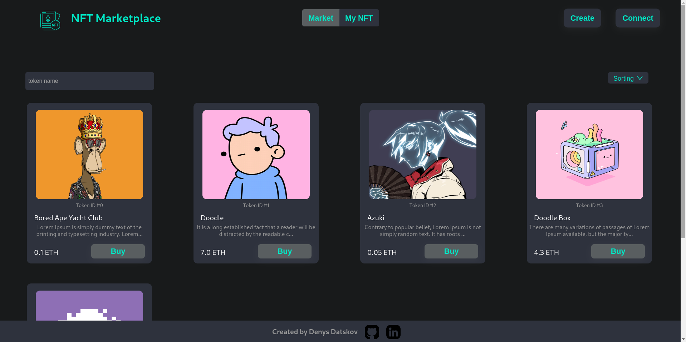

#### Header
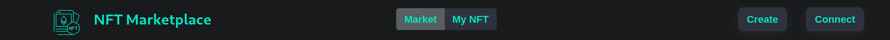
On the left in the header are the name of the service and the logo. On the right is the button to connect the Metamask wallet and to "mint" the new NFT.

In the middle: buttons to switch between NFT sales windows and own non-fungible tokens that have already been purchased on this marketplace.

#### Create modal window
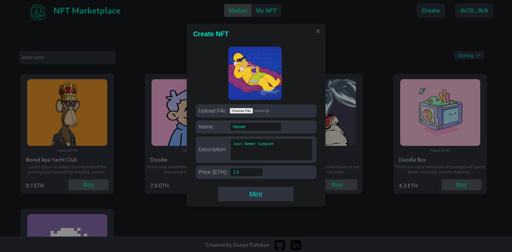
When you click on the "Create" button (for this you must first connect with a crypto-wallet by pressing the "Connect" button), a modal window opens in which you can select an image for the NFT, specify its name and description, as well as the price in Ethers (minimum price 0.001 ETH).

By pressing the "Mint" button, data such as image, name and description will be uploaded to the IPFS decentralized storage, after which a new NFT will be created. Then, after successful processing of the transaction in the blockchain (this may take some time), the new token will be displayed on the Market page.
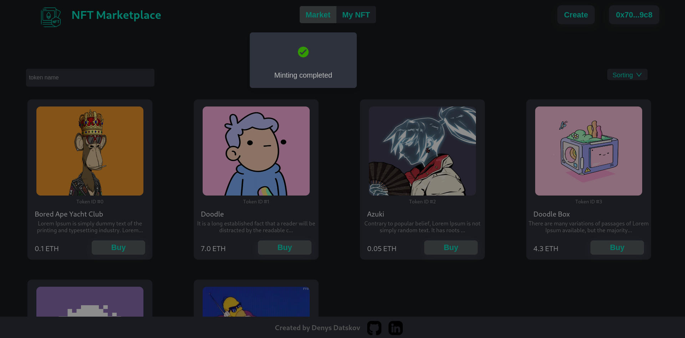

#### Main window
The main window is divided into two parts: top and bottom. At the top - there is a field for searching for NFTs by name, and sorting by price - from larger to smaller, from smaller to larger.
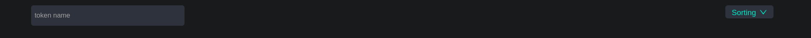
To find an NFT by name, it is enough to write at least a few characters that are in its name in the search.
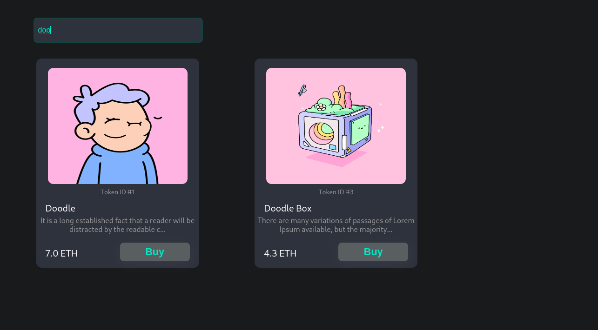

"doo" was entered in the search and all NFTs containing the substring "doo" in their name were displayed. If you leave the search field blank, all NFTs will be displayed. If you enter data that is not in the name of any NFT presented on the marketplace, a corresponding message will be displayed.
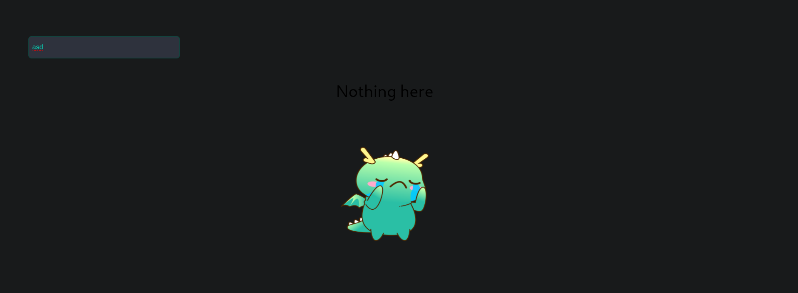

Sort by price from highest to lowest.
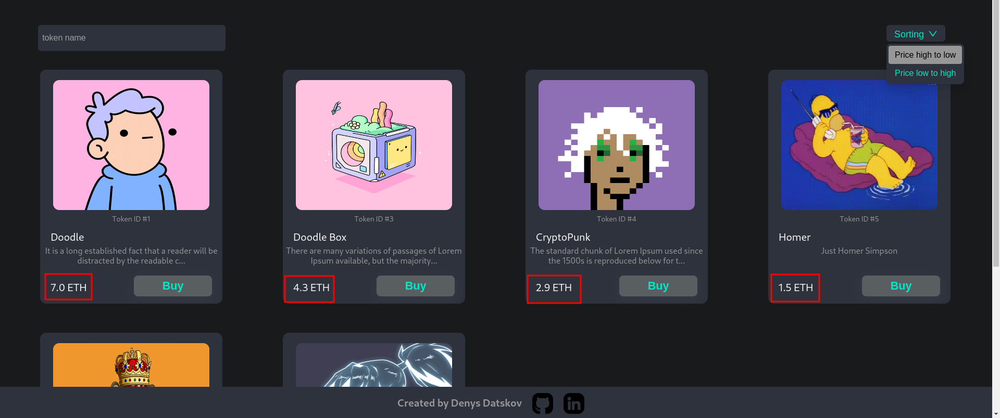

The bottom part shows the NFTs themselves. Each token is displayed in a special block that is visually highlighted. The block contains the following information: picture, token id, name, short description, price and button to buy.

If you click anywhere in the block (except the "Buy" button), an additional modal window will open with more detailed information about a specific token.
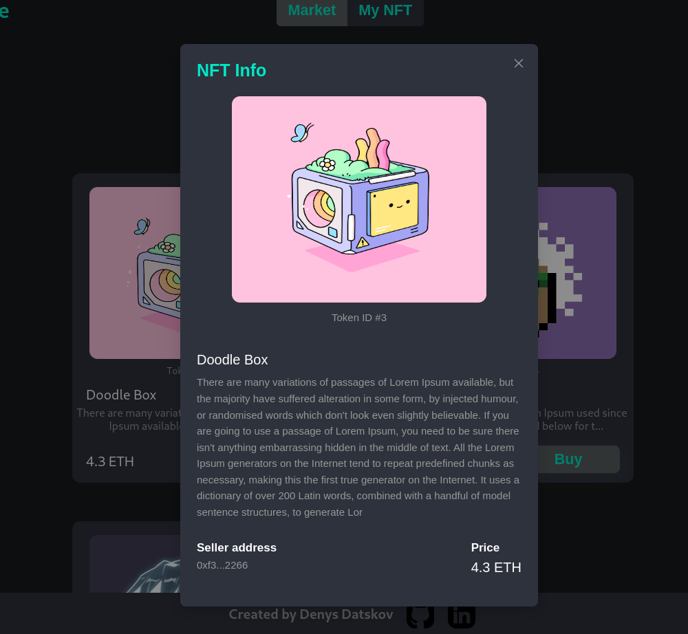

In addition to the information contained in the block, the address of the token seller and a more extended form of description are also displayed here.

Clicking on the "Buy" button will open the Metamask window where you can confirm the NFT purchase. Once the transaction is processed by the blockchain, this NFT will disappear from the Market page and appear on the My NFT page.

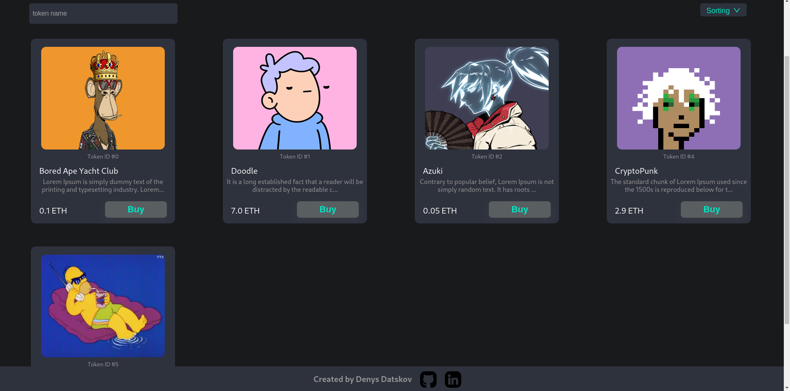
Can be seen with id 3 and name Doodle Box disappeared.
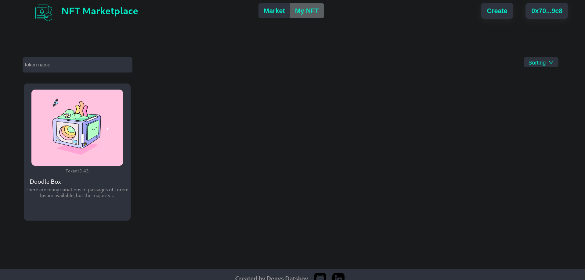
It appeared on the My NFT page, where all tokens purchased by this user will be displayed.
